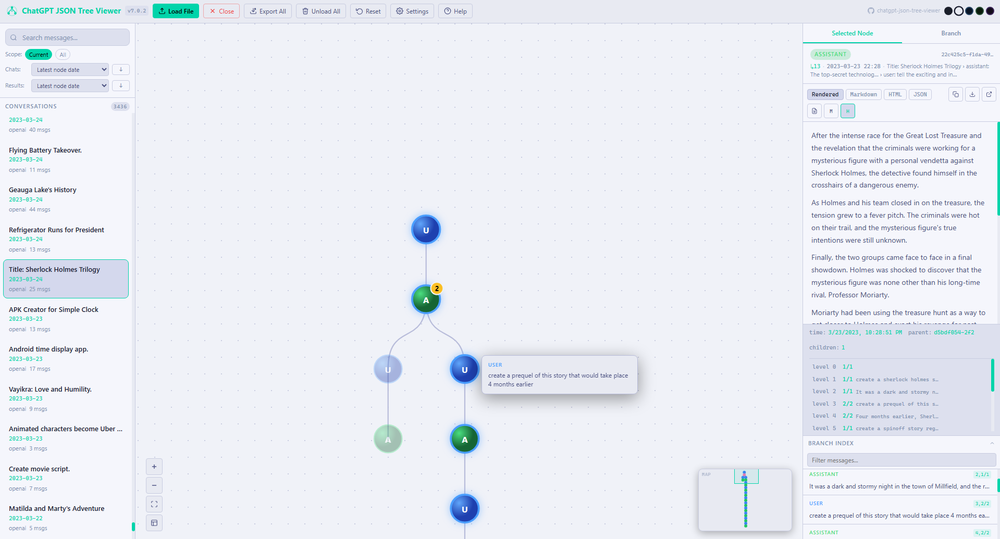

# 🌳 ChatGPT JSON Tree Viewer

*A standalone, offline, multi-platform conversation explorer and branching tree visualizer.*

## 📷 Screenshots



---

## 🧭 Overview

**ChatGPT JSON Tree Viewer** is a **single-file HTML application** that loads exported AI conversation data and converts it into an **interactive branching tree**, complete with metadata inspection, Markdown rendering, multi-format compatibility, full-text search, and a polished UI.

Everything runs **100 percent locally**, right inside your browser.
No servers, no uploads, no telemetry.

This tool supports exports from:

- **ChatGPT / OpenAI** (single conversation and `conversations.json`)
- **DeepSeek** (Chat export, Exporter format, Conversation format)
- **Claude (Anthropic)**
- **xAI Grok**
- **Mistral AI**
- **GLM / Zhipu AI**

The viewer auto-detects format, auto-converts it, and presents it visually.

---

## 🚀 Features

### 🔍 Universal Format Detection

The viewer intelligently identifies and converts all major AI export formats:

| Format | Detection |
|---|---|
| OpenAI / ChatGPT | Single conversation or `conversations.json` array |
| DeepSeek Chat | Mapping with `fragments[]` |
| DeepSeek Exporter | `metadata.platform === "DeepSeek"` |
| DeepSeek Conversation | `messages[].raw_html` |
| Claude / Anthropic | `messages[]` with `role` + `contentChunks` |
| Grok / xAI | `conversation` + `responses[]` |
| Mistral AI | `chat_messages[]` |
| GLM / Zhipu AI | `chat.history.messages` |

It reconstructs parent/child mapping, roles, timestamps, titles, and linear or branching structure.

---

### 🌳 Interactive Graph Viewer

- D3.js tree layout with pan, zoom, and fit-to-screen
- Drag nodes to reposition — moves entire subtree by default; **Shift+drag** to move only the selected node
- **Reset Layout** — animates all nodes back to their original positions
- Color-coded nodes: 🔵 User · 🟢 Assistant · ⭕ System (dashed) · 🟣 Other
- Selected node pulses pink; ancestors pulse blue; descendants pulse green; everything else dims
- Search-matching nodes highlighted with yellow glow
- **Right-click a node** for: Copy Message, Select & View, Delete Node
- **Minimap** in the bottom corner — click to navigate; Ctrl+drag to reposition it; toggle button to show/hide

---

### 📑 Selected Node Panel

Four view modes:

- **Rendered** — Markdown rendered to HTML with syntax-highlighted code blocks
- **Markdown** — raw source text
- **HTML** — rendered HTML source
- **JSON** — raw node object from the internal mapping

Each mode includes:

- **Copy** — copies content in the active view mode
- **Export** — downloads a format-matched file
- **Pop-Out** — opens in a new browser tab
- **PDF** — via jsPDF + html2canvas
- **M** — toggles metadata bar (timestamp, model, parent ID, child count) plus a **level chain** showing every ancestor's depth and position-at-level; click any row to jump to that node
- **H** — toggles search term highlighting (synced with Branch panel)

The node header shows a **location bar** with depth (↳N), timestamp, and ancestor breadcrumb.

---

### 🌿 Branch View Panel

Shows the full conversation path from root to the selected node, in order.

Each message card displays:
- Role badge with color-tinted background (blue / green / gray / purple)
- Depth indicator, timestamp, and ancestor breadcrumb
- **Copy button** on hover

**Filter bar** (three rows):
1. **Show:** — toggle which roles are visible (User / Assistant / System / Other / All)
2. **Search bar** — real-time filter; non-matching messages hidden completely; matches highlighted in yellow
3. **Only in:** — narrows which roles are searched and shown in results

**View modes:** Rendered / Markdown / HTML / JSON — export downloads in the matching format.

**Toolbar buttons:**
- **Copy** — copies all branch messages as plain text
- **Export** — format-matched file download
- **Pop-out** — opens styled thread in a new tab with role shading and per-message copy buttons
- **GPT↓** — exports the current conversation as an OpenAI-compatible `conversations.json`
- **H** — toggles search highlighting

**Branch Index** (collapsible bottom panel) — lists all messages in the branch with depth and position-at-level badge (e.g. `3,2/5`); click to scroll and pulse the target message.

---

### 🔎 Global Search

- Real-time search across the current conversation or **all loaded conversations**
- Result cards show: role, depth (↳N), timestamp, conversation breadcrumb, and highlighted preview snippet
- Clicking a result selects the node, zooms in, and centers the graph — result list stays open for continued browsing
- Matching nodes highlighted with yellow glow on the graph
- Conversations with matches float to the top of the sidebar with a match count badge

---

### 🗂️ Project & Conversation Management

- Load **multiple files** at once; each becomes a separate conversation entry
- **Load dialog** — when files are already open, choose to add to the current project or start fresh
- Sidebar sorted by most-recent message date (`YYYY-MM-DD`)
- **Right-click a conversation** for:
  - **Show Only** — hides others (non-destructive; stashed, not deleted)
  - **Restore All** — brings hidden conversations back
  - **Start Over** — resets all conversations (visible, hidden, deleted) to their original loaded state; warns before proceeding
  - **Export Conv** — downloads as OpenAI JSON
  - **Delete Conv** — stashes to a recovery pool (recoverable via Start Over)
- **Close Conversation** — removes only the active conversation; switches to next if others are loaded
- **Unload All** — clears all conversation pools for a fresh start
- **Export All** (top bar) — exports every loaded conversation as a single OpenAI `conversations.json` array

---

### 🎨 Themes

Five themes, switchable without reload:

- **Dark** (default if OS is in dark mode)
- **Light** (default if OS is in light mode)
- **Blue**
- **Green**
- **Purple**

Theme preference is saved to `localStorage` and applied on every future visit. On first visit, the theme is chosen automatically based on your OS `prefers-color-scheme` setting.

---

### ⚙️ Settings

- **Show system nodes** — toggle visibility of system/prompt nodes (dashed circles)
- **Show other nodes** — toggle visibility of non-standard role nodes (purple circles)
- **Show tooltips** — enable/disable hover previews on graph nodes
- **Tooltip delay** — adjust how long to hover before the tooltip appears (500ms–10,000ms)

All settings saved to `localStorage`.

---

### 🗺️ Minimap

A live-updating canvas minimap shows the full graph with a teal rectangle for the current viewport.

- Click to jump the viewport to any position
- **Ctrl+drag** (⌘+drag on Mac) to reposition the minimap anywhere in the graph area
- Toggle button to hide/show

---

### ↔️ Resizable Panels

Drag handles between the left sidebar, graph, and right panel to resize. The minimap and graph update in real time.

---

### 📚 Help & Changelog

- **Help** button opens a modal with 15 detailed topics and full-text search
- **What's New** tab inside Help shows a versioned changelog
- **License & Credits** topic lists the MIT license, all third-party libraries, and fonts used

---

## 📥 Installation

No installation required. Download and open in your browser:

```
chatgpt-json-tree-viewer.html
```

Everything runs locally. Works best on Chrome, Edge, Brave, or Firefox.

---

## 📘 Usage Guide

### 1. Load a JSON File

Click **Load File** in the top bar, or **drag and drop** a `.json` file onto the graph area.

If conversations are already loaded, a dialog asks whether to add to the current project or start fresh.

### 2. Explore the Graph

- Scroll to zoom; click and drag the background to pan
- Click a node to select it and view its content
- Drag a node to move it with its subtree (Shift+drag for single node)
- Right-click a node for Copy, Select & View, or Delete

### 3. Search Messages

Type in the **search bar** in the left sidebar. Switch between **Current** and **All** scope. Click any result to jump to that node in the graph.

Use the **branch search bar** to filter messages within the current branch view.

### 4. Inspect Message Content

Select a node and use the **Selected Node** or **Branch** tab in the right panel. Switch view modes (Rendered / Markdown / HTML / JSON), then Copy, Export, Pop-Out, or generate a PDF.

### 5. Manage Conversations

When multiple conversations are loaded, use the sidebar to switch between them. Right-click for Show Only, Restore All, Start Over, Export, or Delete.

### 6. Customize

Click **Settings** in the top bar to toggle node types and tooltips. Click the colored dots (top-right) to switch themes.

---

## 🛠️ Libraries Used

| Library | Version | License |
|---|---|---|
| D3.js | v7.9.0 | BSD 3-Clause |
| marked.js | v9.1.6 | MIT |
| DOMPurify | v3.0.6 | Apache 2.0 / MIT |
| html2canvas | v1.4.1 | MIT |
| jsPDF | v2.5.1 | MIT |

Fonts (SIL Open Font License): DM Sans, Literata, JetBrains Mono — served via Google Fonts CDN.

---

## 📄 License

MIT License — see [LICENSE](LICENSE) for details.

---

## Star History

[](https://www.star-history.com/#akivacp/chatgpt-json-tree-viewer&type=date&legend=top-left)
